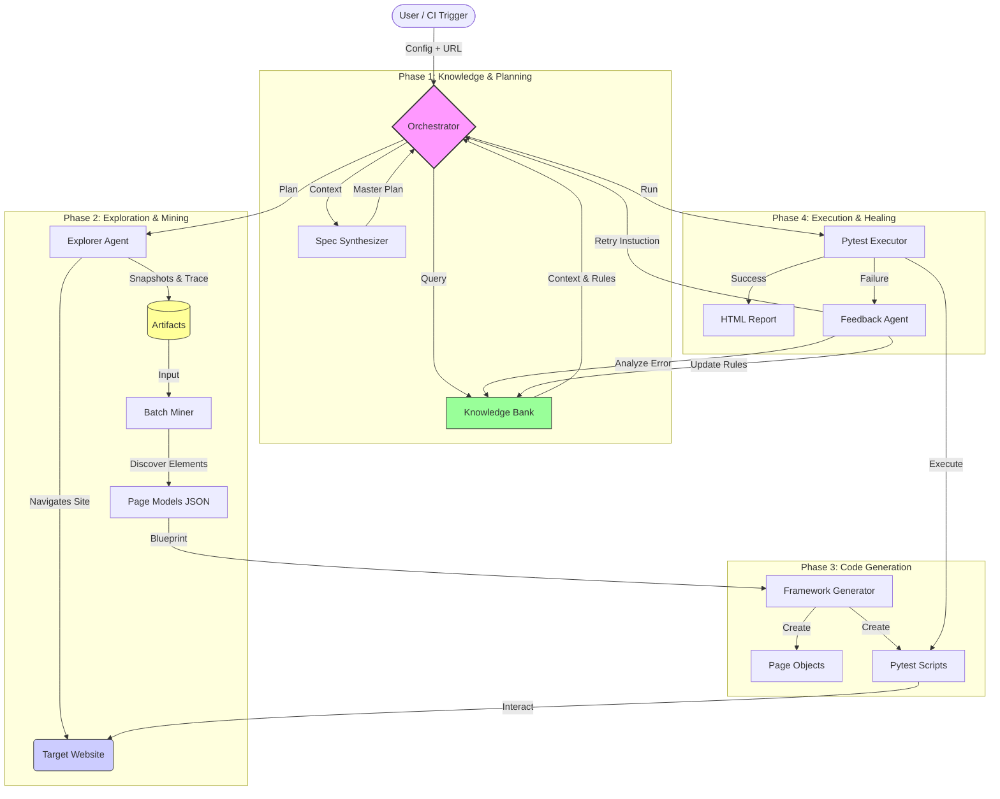

# System Workflow Diagram

This document illustrates the end-to-end flow of the Antigravity Autonomous QA Framework.

## Workflow Description

1.  **Trigger**: The process starts with `trigger_agent.py` receiving a target URL and project configuration.
2.  **Planning**: The `SpecSynthesizer` creates a high-level plan based on the goal (e.g., "Checkout Flow").
3.  **Exploration**: The `Explorer Agent` navigates the live site, capturing DOM snapshots and user interactions.
4.  **Mining**: The `Batch Miner` processes offline snapshots to identify strictly consistent locators and page structures.
5.  **Generation**: The `Framework Generator` builds a standardized Page Object Model (POM) and linear test scripts.
6.  **Execution**: `Pytest` executes the generated tests.
7.  **Self-Healing**: If execution fails, the `Feedback Agent` diagnoses the root cause (e.g., "Modal blocked click"), updates the `Knowledge Bank`, and triggers a retry or regeneration.
